 

# SDUOJ

> [Open Source Online Judge System 开源在线评测系统](https://sduoj.online)

 

<table>
    <tr>
        <td>
            <h3>多业务场景</h3> 
            
评测模板、一题多面、虚拟评测、国际赛制（ACM/OI/IOI），广泛适用于实验训练、学生测试、赛事举办等场景

        </td>
        <td>
            <h3>分布式架构</h3> 
            
基于微服务设计，模块细分更适合业务迭代，分布式架构为高并发、高容错、高可用提供支持

        </td>
        <td>
            <h3>容器级交付</h3> 
            
提供 Docker 镜像，公有云或物理机，均可一键部署，一键扩缩容，以应对不同的流量场景和评测压力

        </td>
    </tr>
</table>

### 概览

* 基于 Docker，公有云或物理机，均可一键部署！
* 前后端分离，分布式微服务架构，可单独对某个服务动态扩缩容以应对不同场景的流量压力！
* 评测机的多核平台调度方案，单点评测、多点评测，按需配置！  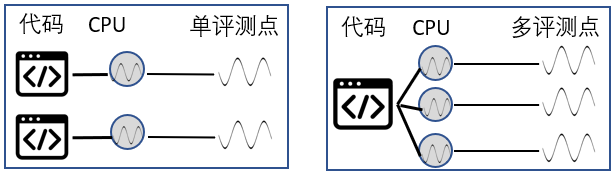
* 多种国际赛制支持（ACM/OI/IOI）！
* 评测模板，可自定义添加多语言支持！更有进阶模式支持数据结构课设、汇编语言实验、操作系统课设等个性化评测场景！
* 一题多面，同一道题目，可有多个题面！可支持中文、英文、俄文等多语言！可支持复杂、精炼、变形题面等多形式！
* Markdown & HTML 题面支持，随意创作丰富多彩的题面！
* ~~虚拟评测，支持世界上多个知名 OJ 系统的远程提交，让训练数据沉淀到一方系统，为未来传承宝贵的数据资产！~~

### 前端截图

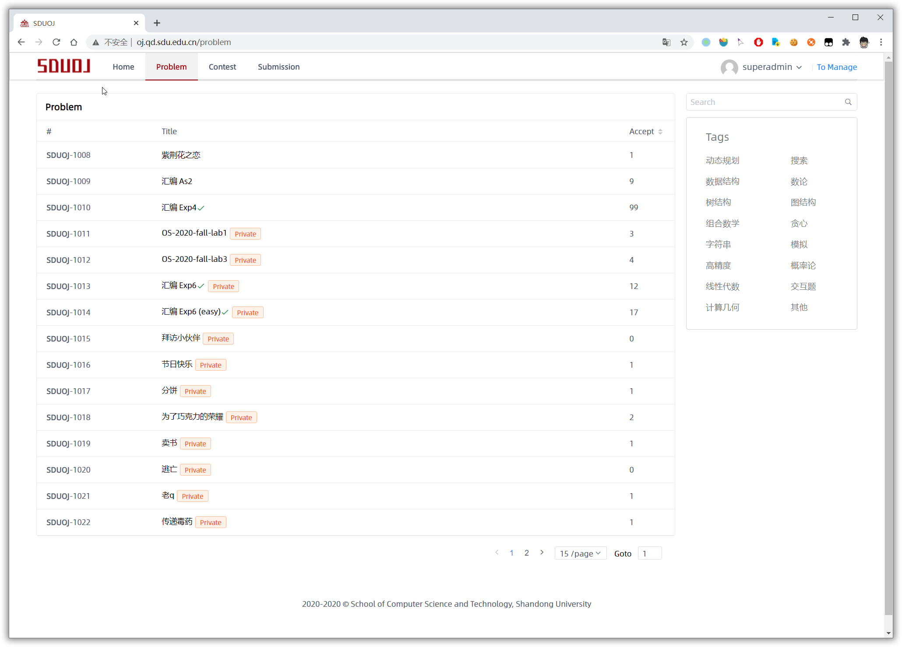

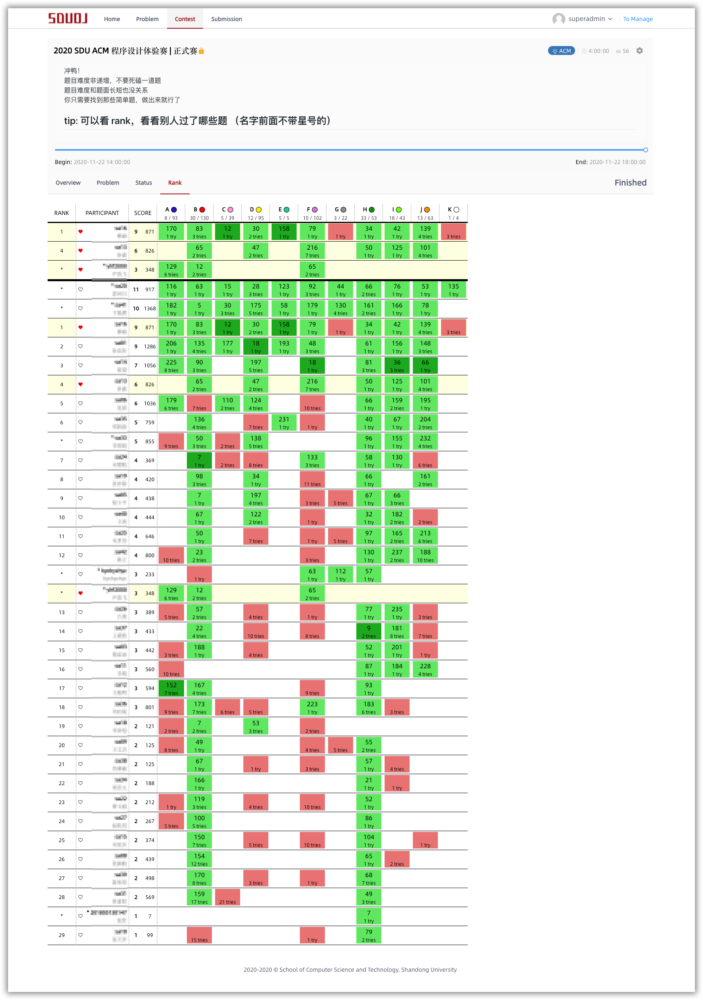

更多截图，点击展开

 

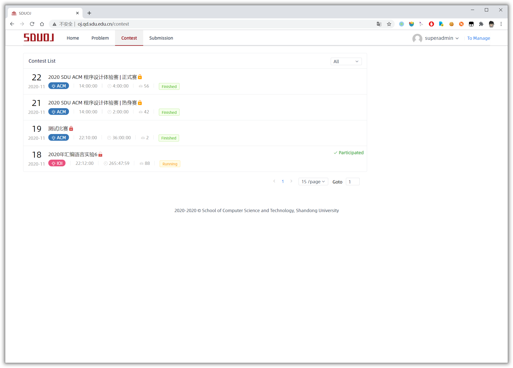

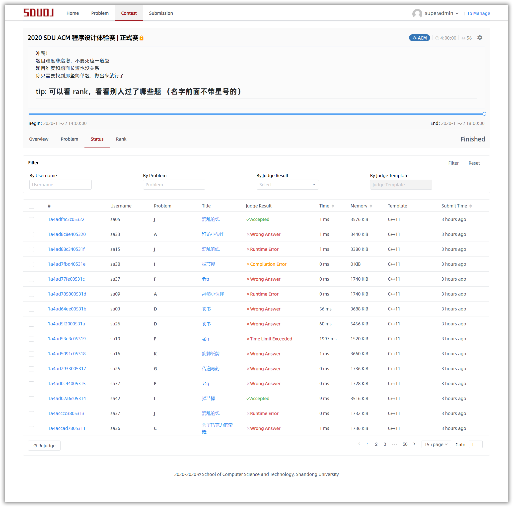

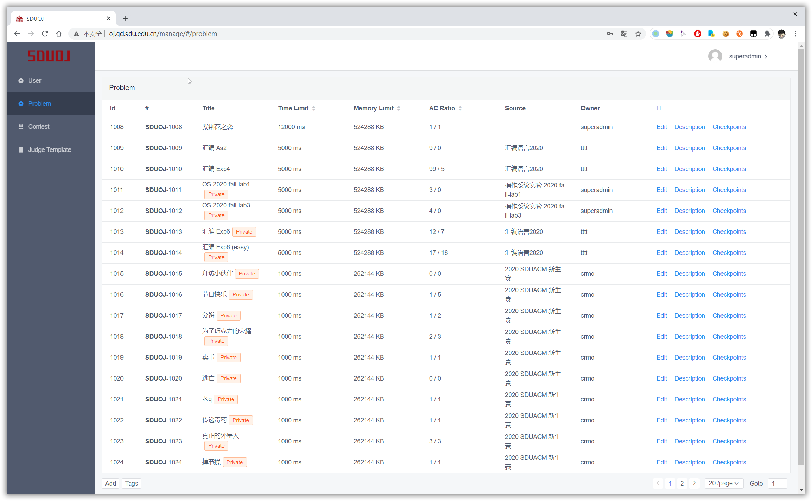

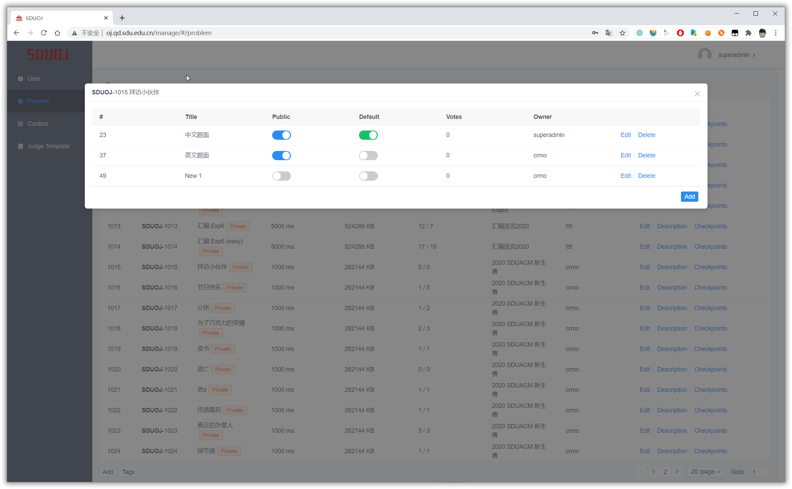

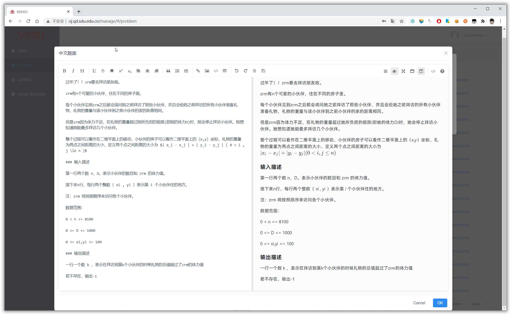

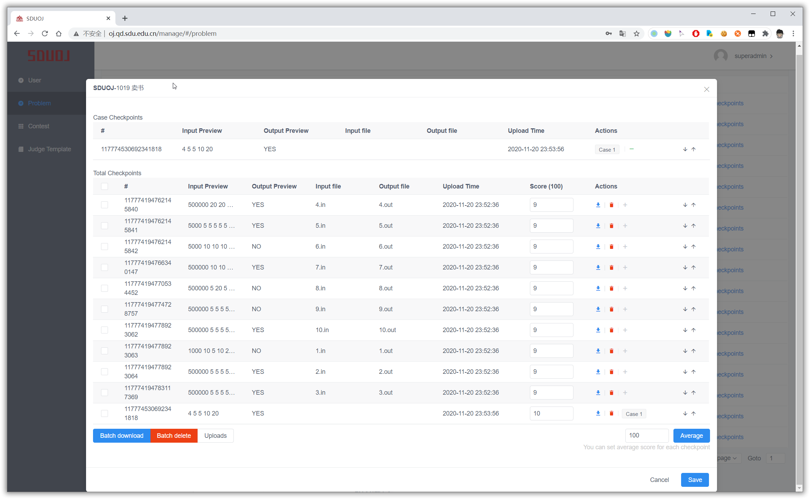

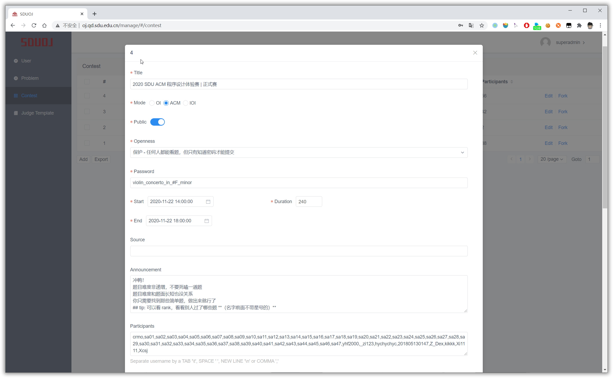

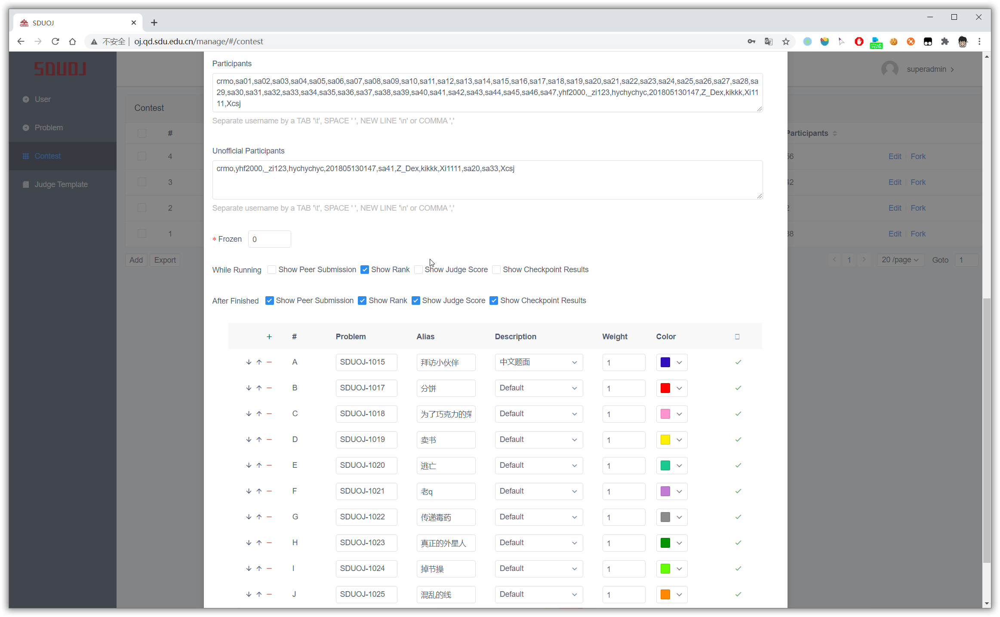

### 搭建指南

架构图：  

[Click Here To Build A SDUOJ](https://sduoj.online/building-guide/)

### 技术博客

主要是：
* 产品理念
* 前端技术
* 后端技术
* 评测机技术
* 沙箱技术

[Click Here To View Tech Blog](https://sduoj.online/technology-blog/)

### 浏览器支持

Modern browsers (chrome, firefox) 和 Internet Explorer 10+.

### 技术团队
<table>
    <tr>
        <td align="center">
            
             
            <a href="https://github.com/zhangt2333" target="_blank">zhangt2333</a>
             
            <strong> 1st dev team </strong>
        </td>
        <td align="center">
            
             
            <a href="https://github.com/jesHrz" target="_blank">jesHrz</a>
             
            <strong> 1st dev team </strong>
        </td>
        <td align="center">
            
             
            <a href="https://github.com/GeneLiuXe" target="_blank">GeneLiuXe</a>
             
            <strong> 1st dev team </strong>
        </td>
        <td align="center">
            
             
            <a href="https://github.com/suxb201" target="_blank">suxb201</a>
             
            <strong> 1st dev team </strong>
        </td>
        <td align="center">
            
             
            <a href="https://github.com/Xrvitd" target="_blank">Xrvitd</a>
             
            <strong> 1st dev team </strong>
        </td>
    </tr>
</table>

### 许可

基于 [GNU General Public License v3.0](https://www.gnu.org/licenses/gpl-3.0.en.html) 开源协议。
