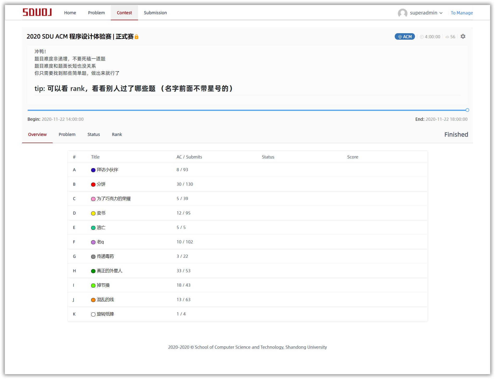
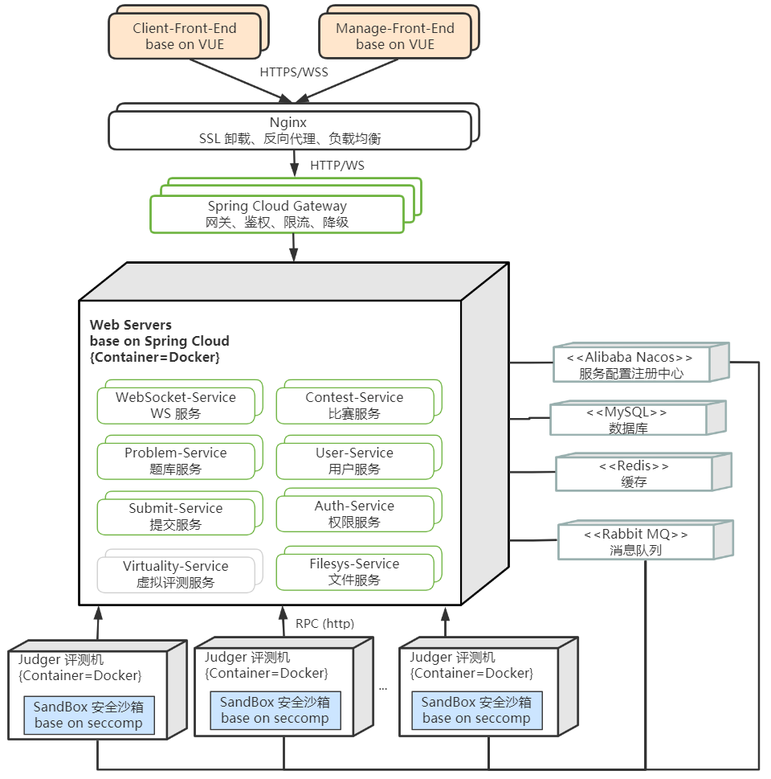

*如果觉得对您有帮助或者对该产品感兴趣，请您给点一个 Star，谢谢！*

# SDUOJ/[Online Judge](https://sduoj.online)

> SDUOJ 是一款开源在线评测系统（Online Judge, OJ）
> 
> [→ 查看文档](https://sduoj.online)
> 

 

<table>
    <tr>
        <td>
            <h3>多业务场景</h3> 
            
评测模板、一题多面、虚拟评测、国际赛制（ACM/OI/IOI），广泛适用于实验训练、学生测试、赛事举办等场景

        </td>
        <td>
            <h3>分布式架构</h3> 
            
基于微服务设计，模块细分更适合业务迭代，分布式架构为高并发、高容错、高可用提供支持

        </td>
        <td>
            <h3>容器级交付</h3> 
            
提供 Docker 镜像，公有云或物理机，均可一键部署，一键扩缩容，以应对不同的流量场景和评测压力

        </td>
    </tr>
</table>

### 概览

* 基于 Docker，公有云或物理机，均可一键部署！
* 前后端分离，分布式微服务架构，可单独对某个服务动态扩缩容以应对不同场景的流量压力！
* 评测机的多核平台调度方案，单点评测、多点评测，按需配置！  
* 多种国际赛制支持（ACM/OI/IOI）！
* 评测模板，可自定义添加多语言支持！更有进阶模式支持数据结构课设、汇编语言实验、操作系统课设等个性化评测场景！
* 一题多面，同一道题目，可有多个题面！可支持中文、英文、俄文等多语言！可支持复杂、精炼、变形题面等多形式！
* Markdown & HTML 题面支持，随意创作丰富多彩的题面！
* 动态评测，提交后每个评测点实时返回评测结果！
* 多评测点，单独赋分，动态调整测试点的顺序，直接选取测试点作为题面样例点！
* ~~虚拟评测，支持世界上多个知名 OJ 系统的远程提交，让训练数据沉淀到一方系统，为未来传承宝贵的数据资产！~~

### 项目仓库

| 仓库                                                         | 描述                                 |
| ------------------------------------------------------------ | ------------------------------------ |
| [SDUOJ/OnlineJudge](https://github.com/SDUOJ/OnlineJudge)    | 产品主仓库、文档、Issue Tracker       |
| [SDUOJ/sduoj-server](https://github.com/SDUOJ/sduoj-server)  | 后端代码仓库                         |
| [SDUOJ/sduoj-web](https://github.com/SDUOJ/sduoj-web)        | 用户前端代码仓库                     |
| [SDUOJ/sduoj-manage](https://github.com/SDUOJ/sduoj-manage)  | 管理员前端代码仓库                   |
| [SDUOJ/sduoj-judger](https://github.com/SDUOJ/sduoj-judger)  | 评测机代码仓库                       |
| [SDUOJ/sduoj-sandbox](https://github.com/SDUOJ/sduoj-sandbox) | 安全沙箱代码仓库                     |
| [SDUOJ/sduoj-deploy](https://github.com/SDUOJ/sduoj-deploy)  | 部署代码仓库，含 Docker Compose 脚本 |

### 网站截图

[用户使用手册](https://sduoj.online/docs/manual/user/home)

更多截图，点击展开

 

### 搭建指南

架构图：

[如何基于 Docker Compose 快速部署？](https://sduoj.online/docs/deployment/docker-compose)

### 浏览器支持

For Vue frontend:
-  Modern browsers (chrome, firefox) 和 Internet Explorer 10+.

For React frontend:
-  Microsoft Edge (85+), Google Chrome (85+), Mozilla Firefox (79+), Apple Safari (13.4+), Internet Explorer is not supported

### 技术团队
<table>
    <tr>
        <td align="center">
            
             
            <a href="https://github.com/zhangt2333" target="_blank">zhangt2333</a>
             
            <strong> Leader, Backend </strong>
        </td>
        <td align="center">
            
             
            <a href="https://github.com/yhf2000" target="_blank">yhf2000</a>
             
            <strong> Leader, Frontend </strong>
        </td>
        <td align="center">
            
             
            <a href="https://github.com/jesHrz" target="_blank">jesHrz</a>
             
            <strong> Leader, Sandbox </strong>
        </td>
    </tr>
    <tr>
        <td align="center">
            
             
            <a href="https://github.com/koi2000" target="_blank">koi2000</a>
             
            <strong> Backend </strong>
        </td>
        <td align="center">
            
             
            <a href="https://github.com/HYLazy" target="_blank">HYLazy</a>
             
            <strong> Backend </strong>
        </td>
        <td align="center">
            
             
            <a href="https://github.com/zhaoyifan0528" target="_blank">zhaoyifan0528</a>
             
            <strong> Backend </strong>
        </td>
    </tr>
    <tr>
        <td align="center">
            
             
            <a href="https://github.com/OldAtaraxia" target="_blank">OldAtaraxia</a>
             
            <strong> Backend </strong>
        </td>
        <td align="center">
            
             
            <a href="https://github.com/zhr2001" target="_blank">zhr2001</a>
             
            <strong> Frontend </strong>
        </td>
        <td align="center">
            
             
            <a href="https://github.com/sys16384" target="_blank">sys16384</a>
             
            <strong> Plagiarism Detection </strong>
        </td>
    </tr>
    <tr>
        <td align="center">
            
             
            <a href="https://github.com/GeneLiuXe" target="_blank">GeneLiuXe</a>
             
            <strong> Honorary Mem. </strong>
        </td>
        <td align="center">
            
             
            <a href="https://github.com/suxb201" target="_blank">suxb201</a>
             
            <strong> Honorary Mem. </strong>
        </td>
        <td align="center">
            
             
            <a href="https://github.com/Xrvitd" target="_blank">Xrvitd</a>
             
            <strong> Honorary Mem. </strong>
        </td>
    </tr>
</table>

### 许可

基于 [GNU Affero General Public License v3.0](https://www.gnu.org/licenses/agpl-3.0.en.html) 开源协议。

